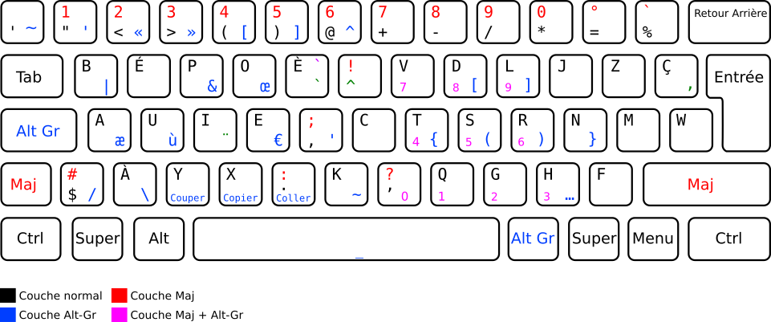

# Disposition de clavier Bépo Dev

Fichier xkb et keylayout de la disposition Bépo modifié pour « optimiser » mon usage du Bépo dans le cadre de mon activité le développement.



## Modifications apportées

- Passage en accès direct des touches < >.
- Déplacement de … pour ne pas les perdres suite au remapping.
- Remplacement de la touche Verr Maj. par Altgr.
- Déplacement des symboles plus lié au développement ({}, (), []) en accès sur la main droite sur le layer Altgr.
- Inversion du W et du Ç.
- Ajout d'un pavé numérique sous la main gauche avec Maj + Altgr (main droite)
- Ajout du point médian (·) sur Altgr + .

## Utilisation

### X11, utilisation sans droit root

- Créer le chemin ~/.xkb/symbols/
- Déplacer le fichier bepoDev dans ~/.xkb/symbols/
- Appliquer la modification :

```sh
setxkbmap -I ~/.xkb bepoDev -print | xkbcomp -I$HOME/.xkb - $DISPLAY
```

Ou via l'extension Gnome : https://github.com/c4software/xkbswitcher

### MacOs

Déplacer les fichier .keylayout dans le dossier ```/Library/Keyboard Layouts/```. Déposer dans la disposition dans le dossier global permet de l'avoir des l'écran de login, ainsi que dans les champs de saisie de mot de passe.

⚠️ Attention Safari à l'air de corrompre le fichie .keylayout « le plus simple » c'est de récupérer le fichier avec wget :

```sh
cd /Library/Keyboard\ Layouts
sudo wget https://raw.githubusercontent.com/c4software/bepo_developpeur/master/osx/bepoDev.keylayout
```
