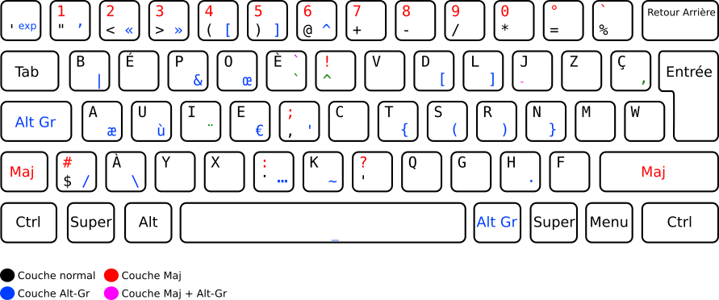

# Disposition de clavier BépoDev

Fichier xkb et keylayout de la disposition Bépo modifié pour « améliorer » mon usage du Bépo dans le cadre de mon activité.



## Modifications :

- Passage en accès direct des touches < >.
- Création des raccourcis Couper, Copier, Coller sur les touches équivalentes aux raccourcis azerty mais sur le layer Altgr (Linux seulement).
- Déplacement de … pour ne pas les perdres suite au remapping.
- Remplacement de la touche Verr Maj. par Altgr.
- Transformation de la toucher Altgr en Verr Altgr (fonctionnement similaire à Verr Maj mais sur le layer Altgr).
- Ajout j k l m sur le layer shift+Altgr.
- Déplacement des symboles plus lié au développement ({}, (), []) en accès sur la main droite sur le layer Altgr.
- Inversion du W et du Ç.

## Utilisation (Linux):

### X11:

- Créer le chemin ~/.xkb/symbols/
- Déplacer le fichier bepoDev dans ~/.xkb/symbols/
- Appliquer la modification :

```
	setxkbmap -I ~/.xkb bepoDev -print | xkbcomp -I~/.xkb - $DISPLAY
```
