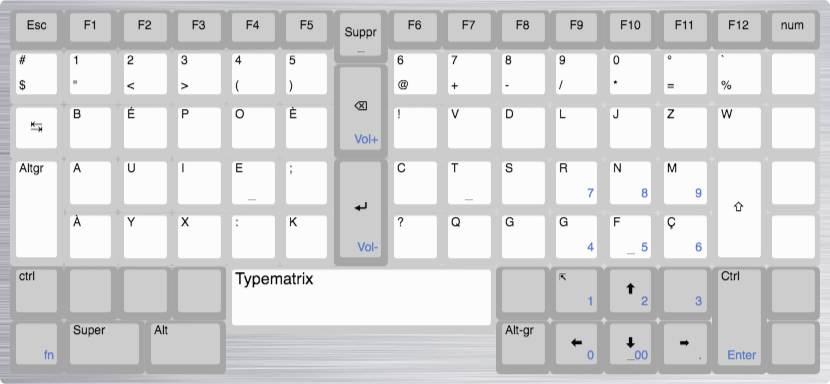

# Typematrix Remap

Avec le déplacement de la touche Alt-gr le layout par défaut du Typematrix ne me convient pas vraiment. Je trouve la touche altgr « vraiment mal placée » en attendant de rendre mon [typematrix programmable](https://github.com/c4software/typematrix) voilà les modifications pour Linux et MacOS.

